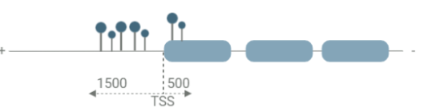
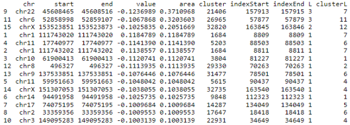
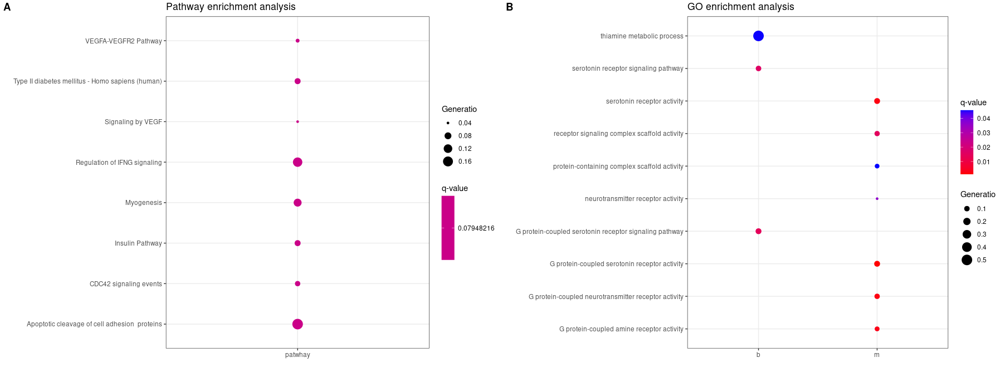
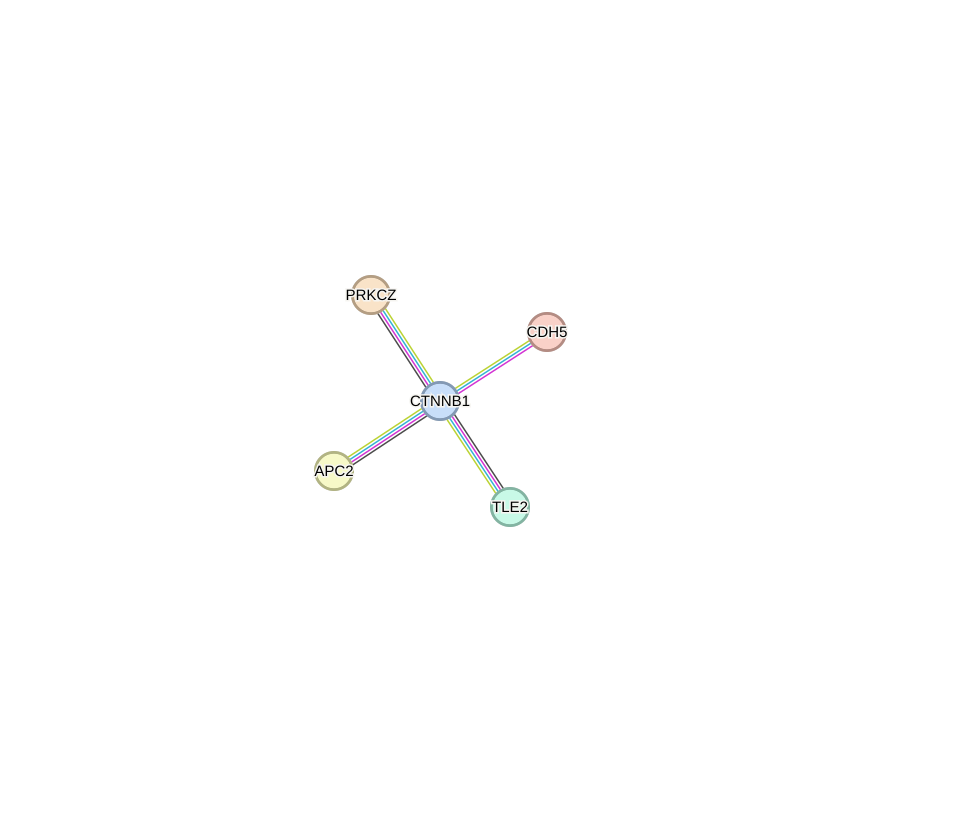
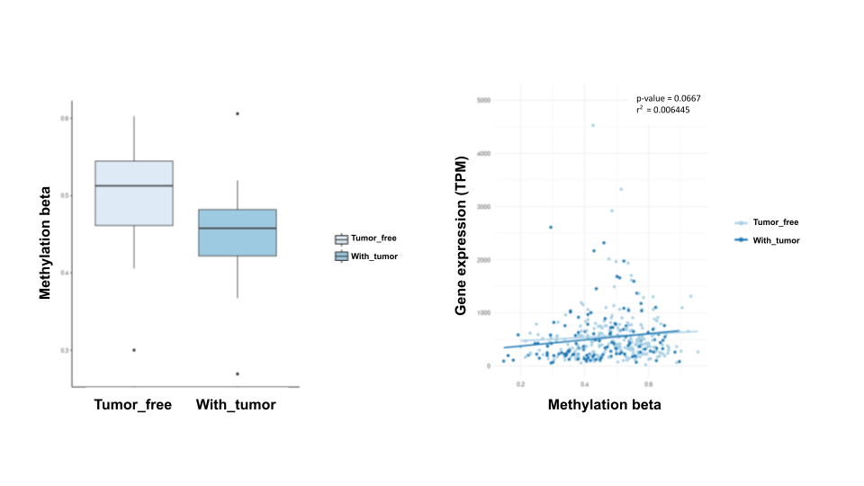

1.  **Abstract**

2.  **Introduction**

3.  **Materials and Methods**

```{=html}
<!-- -->
```
I.  Research Participants

The methylation array pre-processed beta value was available via the GDC
data portal (Data release 35.0)[1], and RSEM gene expression and
clinical patient data were available from cBioPortal.[2]

We reviewed the clinical and genetic tumor data of 412 patients with
bladder urothelial cancer obtained from The Cancer Genome Atlas (TCGA).
We subset the patients with missing tumor status (
Tumor-free,with-Tumor, n= 372) and selected only patients when RSEM gene
expression was available. Finally, of the 412 patients, 368 patients
were enrolled in the study.

<center>

| Variables  | Count (n=368) |
|------------|:-------------:|
| Age        |               |
| \< 65      | 136 (36.96%)  |
| \< 65      | 232 (63.04%)  |
| Sex        |               |
| Female     |  94 (25.54%)  |
| Male       | 274 (74.46%)  |
| Status     |               |
| Tumor Free | 234 (63.59%)  |
| With Tumor | 134 (36.41%)  |

**Table1** Clinical features of a patient with bladder urothelial
carcinoma in TCGA

</center>

II. DNA methylation data pre-processing

Bladder cancer recurrence was defined based on the tumor status
previously described by Shen et al.[3] In this study, we classified the
recurrence status based on the neoplasm tumor status column in the
patient data. The term "With Tumor" represents the persistence of the
tumor, but not a new tumor event, and is classified as disease
recurrence. The "Tumor Free" status was classified as having no disease
recurrence. It is important to note that "tumor-free" does not mean
"normal" because the "normal" case insists that the tumor never occurred
in the past and/or present. Furthermore, "tumor-free" specifies that the
tumor cannot be measured and that there is still a chance of recurrence.

The given methylation level was quantified and calculated as
$\beta=\frac{\mu}{(M+U+\alpha)}$ where M and U denote the methylated and
unmethylated signals and $\alpha$ represent an offset value. The given
gene expression level was quantified by TPM and normalized using the
RSEM R package, such that
$TPM_{i}=\frac{q_{i}/l_{i}}{\sum_{j}(q_{i}/l_{i})} * 10^{6}$ where
$q_{i}$ denotes reads mapped to transcripts, $l_{i}$ is the transcript
length. The gene expression level was mapped to the hg19 genome and
generated RSEM gene expression data. The promoter region was defined as
1500bp upstream and 500bp downstream from the transcription start site.
A total of 21,010 genes (164,113 methylation probes) were tested.

<center>



**Figure 1**: A schema methylation proves within the promoter region.
Methylation probes between -1500 and +500bp from the transcription start
site are considered.

</center>

```{r message=FALSE}
# We download data from cbiobank data_mrna_seq_v2gz, data_clinical_patient.txt.gz and methylation data from GDC portal.
library(tidyr)
library(dplyr)
library(data.table)
library(limma)
library(bumphunter)
library(biomaRt)
library(TxDb.Hsapiens.UCSC.hg19.knownGene)
library(GenomicFeatures)
library(tidyverse)

#Loading all datas
# dir <- c("/pine/scr/s/e/seyoun/project_784/Comp_Bio_784_FinalProject/01.data")
rsem <- fread("01.data/data_mrna_seq_v2_rsem.txt.gz") |> as.data.frame()
patient <- fread("01.data/data_clinical_patient.txt.gz") |> as.data.frame()
methyl <- fread("01.data/TCGA-BLCA_DNAmethylation450k_Methyl.txt_v2.gz") |> as.data.frame()
```

```{r}
# This steps were only selecting the samples in "Tumor-free and "Tumor"  
methly_beta <- methyl[,-c(1:4)]
methyl_nodup <- as.data.frame(sapply(unique(names(methly_beta)),function(col) rowMeans(methly_beta[names(methly_beta) == col])))

colnames(rsem) <- c(colnames(rsem)[1:2],gsub('.{3}$',"",colnames(rsem)[-c(1:2)]))
tumor_status <- c("TUMOR FREE","WITH TUMOR")
patient_subset <- patient[,c(2,21)][is.element(patient[,21],tumor_status),]

sub_methyl <- cbind(methyl[,1:4],methyl_nodup[,(is.element(colnames(methyl_nodup), patient_subset[,1]))])
sub_rsem <- cbind(rsem[,1:2],rsem[,(is.element(colnames(rsem), patient_subset[,1]))])

subset_nm <- colnames(sub_methyl[,!is.element(colnames(sub_methyl),colnames(sub_rsem))])[-c(1:4)]
#three samples are not overlapping with methylation and gene expression. Therefore, to match up, we subtract "TCGA-XF-A9SG" "TCGA-ZF-A9RG" "TCGA-XF-AAMF".

sub_methyl_2 <-sub_methyl[,!is.element(colnames(sub_methyl),subset_nm)]

# This step is removing probes with row containing missing values: 102,702 probes are
sub_methyl_3 <- sub_methyl_2 %>% drop_na()
```

```{r message=FALSE}
#Finding the promoter region -1500, +500 from TSS
library(biomaRt)
library(TxDb.Hsapiens.UCSC.hg19.knownGene)
library(GenomicFeatures)
library(tidyverse)
library(ChAMP)

ensembl=useMart("ensembl")
ensembl = useDataset("hsapiens_gene_ensembl",mart=ensembl)
#save(ensembl,file="ensembl"

#If you havent make the ensemble, please run useMART and create ensemble
# load("ensembl")
sub_methyl_3[,"Chromosome"] <- sub("^","chr",sub_methyl_3[,"Chromosome"])
methyl.ran <- GRanges(Rle(sub_methyl_3[,"Chromosome"]),IRanges(sub_methyl_3[,"Genomic_Coordinate"],sub_methyl_3[,"Genomic_Coordinate"]))

#We are using hg19
txdb <- TxDb.Hsapiens.UCSC.hg19.knownGene

#promoter region set up to 1500, 500
promoter.re <- promoters(txdb,upstream=1500,downstream=500)


fi.cns <- c("TXID","TXCHROM","TXNAME","GENEID","TXSTART","TXEND","TXSTRAND")
txTable <- gsub(" ","",as.matrix(biomaRt::select(txdb,keys=names(promoter.re),columns=fi.cns,keytype="TXNAME")))
txTable <- txTable[!is.na(txTable[,2]),]

map.id <- getBM(attributes=c("hgnc_symbol","entrezgene_id"),filters="entrezgene_id", values=txTable[,"GENEID"],mart=ensembl)
mer.txTable <- unique(as.matrix(merge(txTable,map.id,by.x="GENEID",by.y="entrezgene_id")))
rownames(mer.txTable) <- mer.txTable[,"TXNAME"]


inter.pro.methyl <- as.matrix(findOverlaps(methyl.ran,promoter.re))
inter.pro.methyl <- inter.pro.methyl[is.element(names(promoter.re)[inter.pro.methyl[,2]],rownames(mer.txTable)),]
pro.met.re <- cbind(mer.txTable[names(promoter.re)[inter.pro.methyl[,2]],"hgnc_symbol"],sub_methyl_3[inter.pro.methyl[,1],c(1,3,4)])
colnames(pro.met.re) <- c("gene","methyl","chr","pos")
pro.met.re <- unique(pro.met.re[which(pro.met.re[,"gene"] != ""),])
#Final pro.met.re contains gene name, methylation id, chromosome, and position. 

```

III. Differential methylation analysis

Bumphunter analysis-Differential methylation region

We used the averaged methylation value of all CpGs within the promoter
region of a gene to identify differential methylation between the tumor
existence in bladder cancer. Using the bumphunter function adapted from
the minfi R package, we obtained differential methylation regions
(DMRs). The Bumphunter function searches for DMRs by looking for GpGs
with mean differences.[4] The statistical model follows:
$Y\_{ij}=\beta_{0}(l_{j}) +\beta_{1}(l_{j})X\_{j}+\varepsilon_{ij}$ The $i$ denotes the subject, $l_{j}$ represents the jth location, $X_{j}$ is the covariate of interest, $\varepsilon_{ij}$ denotes error, $\beta*{0}$ denotes for baseline function and $\beta_{1}(l)$ is the parameter of interest. There are three steps: 1) creating clusters by t-statistical at each genomic location and a phenotype of interest, 2) breaking into segments by candidate region to be a cluster of probes, 3) Test for the significance of the candidate region.  In this study, we used the covariates age and sec and the p-value adjusted FDR was below 0.05, and a change in methylation greater than 10% ($\Delta\beta > 0.1$) was used to identify a significant bump differential methylation region. 


```{r message=FALSE}
#Bumphunter()
library(minfi)
library(MultiDataSet)

promoter_met_mat <- sub_methyl_3[(is.element(sub_methyl_3[,"Hybridization-REF"],pro.met.re[,"methyl"])),]
rownames(promoter_met_mat) <- promoter_met_mat[,1]
mat <- promoter_met_mat[,-c(1:4)] %>% as.matrix()
grset <- makeGenomicRatioSetFromMatrix(mat)
patient_coldata <- patient[is.element(patient[,21],tumor_status),]
patient_coldata <- patient_coldata[(!is.element(patient_coldata[,2],subset_nm)),]
colnames(patient_coldata) <- gsub("\\s", "", colnames(patient_coldata))
patient_coldata[,21] <- gsub("\\s", "", patient_coldata[,21])
patient_coldata$NoninvasiveBladderCancerTreatmentType %<>% gsub("\\(|)", "", .) %>% gsub("\\[|]","",.) %>% gsub("\\s", "",.)
colData(grset) <- cbind(colData(grset),patient_coldata[ order(match(patient_coldata[,2],rownames(colData(grset)))), ])

status <- pData(grset)$PersonNeoplasmStatus
treatment <- pData(grset)$NoninvasiveBladderCancerTreatmentType
sex <-  pData(grset)$Sex
age <- pData(grset)$DiagnosisAge

deseignmatrix <- model.matrix(~status+sex+age)
#we use sex and age for covariates and 10% difference between the two groups

dmrs <- bumphunter(grset, design =deseignmatrix, type="Beta",cutoff=0.1)
save(dmrs,file="dmrs")
head(dmrs$table)
```

```{r}
library(limma)
library(dplyr)
library(readr)
library(ggplot2)

theme_set(theme_bw())

# subset methylation data according to pro.met.re
# and remove old, unnecessary columns
working.data = left_join(pro.met.re, sub_methyl_3, by=c('methyl'='Hybridization-REF'))
working.data = working.data %>% dplyr::select(-Gene_Symbol, -Chromosome, -Genomic_Coordinate)

# only need working.data
rm(list=setdiff(ls(), "working.data"))

# stash row information
meta.data = working.data[,1:4]

# average methylation by gene
working.data = working.data %>%
  dplyr::select(-methyl, -chr, -pos) %>%
  group_by(gene) %>%
  summarize_all(mean)

# load patient data
clinical.patient = read_delim('01.data/data_clinical_patient.txt', skip=4)
clinical.sample = read_delim('01.data/data_clinical_sample.txt', skip=4)

# combine the data and subset to those in working.data
patient = inner_join(clinical.patient, clinical.sample, by='PATIENT_ID')
patient = patient %>%
  filter(PATIENT_ID %in% colnames(working.data)) %>%
  group_by(PATIENT_ID) %>%  # one patient has two samples, remove second one
  dplyr::slice(n=1) %>%
  ungroup()
rm(list=c('clinical.patient', 'clinical.sample'))

# set column names lower case
colnames(patient) = tolower(colnames(patient))

# put patient data in same order as methylation data
patient = patient[match(colnames(working.data[,-1]), patient$patient_id), ]


# Limma -------------------------------------------------------------------


# patient covariate matrix
design.matrix = model.matrix(~ tumor_status + sex + age,
                             data = patient)
colnames(design.matrix) = c('(Intercept)', 'tumor', 'male', 'age')

# fit models
limma.fit = lmFit(working.data[,-1], design=design.matrix)
limma.fit.eb = eBayes(limma.fit)

# look at results
top.table = topTable(limma.fit.eb, coef='tumor', sort.by='p', p.value=0.2, number=10000)

# extract gene names and meta information
genes.select = working.data$gene[as.numeric(row.names(top.table))]
genes.select.up = working.data$gene[as.numeric(row.names(top.table %>% filter(logFC>0)))]
genes.select.down = working.data$gene[as.numeric(row.names(top.table %>% filter(logFC<0)))]
genes.final = meta.data %>% filter(gene %in% genes.select)

top.table$gene = genes.select

# # save it
# write_csv(genes.final, 'diff_meth_genes.csv')


# # looking at residual plots
# row_num = 5
# fitted.values = limma.fit.eb$design %*% limma.fit.eb$coefficients[row_num,]
# plot(fitted.values, working.data[row_num, 2:ncol(working.data)])

```

```{r}
# Plots -------------------------------------------------------------------

# # volcano plot
# volcanoplot(limma.fit.eb, coef='tumor', names=working.data$gene,
#             highlight = 135)

# do manual volcano plot

# get all results
all.res = topTable(limma.fit.eb, coef='tumor', sort.by='p', number=100000)
all.res$highlight = all.res$adj.P.Val < 0.2

# plot
gg_volcano = ggplot(all.res %>% mutate(P.Value = -log10(P.Value)), 
                    aes(x=logFC, y=P.Value, color=highlight)) +
  geom_point(size = 0.7) +
  scale_color_manual(values = c('black', 'blue')) +
  scale_x_continuous(limits = c(-0.1, 0.1)) +
  scale_y_continuous(limits = c(0, 6.2)) +
  labs(x = 'beta coefficient',
       y = '-log10(p-value)') +
  theme(legend.position = 'none')

gg_volcano
```

```{r}
# pca
working.data.select = working.data %>% filter(gene %in% genes.select)
pc.0 = prcomp(t(working.data.select[,2:ncol(working.data.select)]))
dat = data.frame(pc.0$x[,1:2], tumor = patient$tumor_status)
ggplot(dat, aes(x=PC1, y=PC2, col=tumor)) +
  geom_point() +
  labs(title='pca on 128 identified genes')
```

```{r}
# mRNA --------------------------------------------------------------------

# read in data
mrna = read_delim('01.data/data_mrna_seq_v2_rsem.txt')

# subset to match working.data
mrna = mrna %>%
  dplyr::rename(gene = Hugo_Symbol) %>%
  dplyr::rename_all(function(x) gsub('-01$', '', x)) %>%
  dplyr::select_at(colnames(working.data))

# do log(1+x) transform
mrna[,2:ncol(mrna)] = log(1+mrna[,2:ncol(mrna)])

# # do pca
# pc.1 = prcomp(t(mrna[,2:ncol(mrna)]))
# dat = data.frame(pc.1$x[,1:2], tumor = patient$tumor_status)
# ggplot(dat, aes(x=PC1, y=PC2, col=tumor)) +
#   geom_point() +
#   labs(title='pca on transformed gene expression, all genes')
```

```{r}
# subset to match 128 identified genes
# only 120 in the dataset
mrna = mrna %>%
  filter(gene %in% genes.select)

# # pca
# pc.2 = prcomp(t(mrna[,2:ncol(mrna)]))
# dat = data.frame(pc.2$x[,1:2], tumor = patient$tumor_status)
# ggplot(dat, aes(x=PC1, y=PC2, col=tumor)) +
#   geom_point() +
#   labs(title='pca on transformed gene expression, 135 identified genes')
```

```{r}
# correlation b/t gene expression and diff methylation
mrna.avg = cbind(mrna$gene, rowMeans(mrna[,2:ncol(mrna)])) %>% as.data.frame()
top.table.2 = top.table %>%
  filter(gene %in% mrna$gene)
top.table.2 = top.table.2[match(mrna.avg$V1, top.table.2$gene), ]
cor(top.table.2$logFC, as.numeric(mrna.avg$V2))

dat = data.frame(diff_meth = top.table.2$logFC, 
                 gene_exp = as.numeric(mrna.avg$V2))
ggplot(data=dat, aes(x=diff_meth, y=gene_exp)) +
  geom_point() +
  labs(x = 'Differential methylation (beta)',
       y = 'Average gene expression, log(1+x)')

```

IV. Functional enrichment and network analysis

Functional enrichment analysis using ConsensusPathDb (Release35, CPDB:http://cpdb.molgen.mpg.de/CPDB)[5] was used to interpret the functional role of a gene identified with differential methylation status. Both significant pathway and gene ontology (GO) terms were defined as having an adjusted p-value( <= 0.05). We constructed a protein-protein interaction (PPI) network for the significant methylated genes by string DB (Version 11.5).[6] We selected the interaction relationship between genes with the highest confidence > 0.9. Pathway and GO term visualized ggplot2 in R package (version 3.4.0).


```{r message=FALSE}
#Finding genes in the DMR region
load("dmrs")
txdb <- TxDb.Hsapiens.UCSC.hg19.knownGene
load("ensembl")
bumphunter_gr <- GRanges(Rle(dmrs$table[,"chr"]),IRanges(dmrs$table[,"start"],dmrs$table[,"end"]+20000))
gene_list <- subsetByOverlaps(genes(txdb),bumphunter_gr)
map_ids <- getBM(attributes=c("hgnc_symbol","entrezgene_id"),filters="entrezgene_id", values=gene_list$gene_id,mart=ensembl)

map_ids #There are 15 genes identified in DMR region

#those are the genes that limma and bumphunter overlaps
intersect(top.table$gene,map_ids$hgnc_symbol)
```

```{r message=FALSE}
go <- fread("go.txt",sep ="\t", header = TRUE, stringsAsFactors = FALSE)
newgo <- cbind(go,do.call(rbind,lapply(strsplit(go$members_input_overlap_geneids,";") ,function(y)length(y))))
newgo$Generatio <- newgo$V1/newgo$size
newgo <- newgo  %>% as.data.frame

path <- fread("path.txt", sep ="\t", header = TRUE, stringsAsFactors = FALSE)
newpath <- cbind(path,do.call(rbind,lapply(strsplit(path$members_input_overlap_geneids,";") ,function(y)length(y))))
newpath$Generatio <- newpath$V1/newpath$size
 newpath$pathwaynm <- c(rep("patwhay"))
newpath <- newpath  %>% as.data.frame

par(mfrow=c(1,2))


# import package
library("ggplot2")

# create fake data
set.seed(1024) # keep reproducibility
go <- paste0("GO", sample(1000:2000, 5))
data <- data.frame("GOs" = rep(go, 2), 
                   "Condition" = rep(c("A", "B"), each = 5),
                   "GeneRatio" = 1 / sample(10, 10), 
                   "p.adjust" = 0.05 / sample(10, 10))

library(ggpubr)
# plot: Go


ggplot(newgo, aes(x = newgo[,"term_category"], y = newgo[,"term_name"], 
	color = as.double(newgo[,2]), size = as.double(newgo[,"Generatio"]))) +
	geom_point() +
	scale_color_gradient(low = "red", high = "blue") +
	theme_bw() +
	ylab("") +
  	xlab("") +
   	ggtitle("GO enrichment analysis")+
	labs(size="Generatio", colour="q-value")


# plot: pathway

ggplot(newpath, aes(x = pathwaynm , y = pathway, 
	color = as.double(newpath[,2]), size = as.double(newpath[,"Generatio"]))) +
	geom_point() +
	scale_color_gradient(low = "red", high = "blue") +
	theme_bw() +
	ylab("") +
  	xlab("") +
   	ggtitle("Pathway enrichment analysis")+
	labs(size="Generatio", colour="q-value")


```

4.  **Results**

    I.  **Overview of the study cohort**

    II. **Differential DNA methylation analysis in the two subgroups**

        i.  **Linear**

        ii. **Bumphunter**
        
        A subset of 164,113 CpG methylation sites out of a total of 485,577 CpG sites was mapped to specific promoters( 21,010 genes) for analysis. Differential methylation region was examined in the individual with a history of recurrence of tumor existence. The age and sex defined our study phenotype of interest. The 15 significant differential methylated regions were identified. With this region, there were predominately hypomethylated (n=13) in "With-Tumor" when compared to "Tumor-free."  This result corresponds to our limma significant differential methylation genes, and MOORE et al.[7]study, which showed global methylation in DNA from blood cells and leukocyte DNA hypomethylation was strongly associated with increased bladder cancer risk. In the DMR region, Fifteen genes were identified, and fourteen were protein-coding genes. Eleven genes were strongly related to bladder cancer.  Nine genes overlap with the limma result. 

<center>



**Figure 2**: Bumphunter output
</center>

    III. **Functional enrichment analysis and network**
    
    Overrepresentation analysis of the combined set of both tools(limma and bumphunter), we identified 134 significant genes using ConsensusPathDB and revealed eight critical pathways ( q-value < 0.1). (Figure 3) This includes multiple vascular formation-related pathways:  Myogenesis, CDC42 signaling events, Apoptotic cleavage of cell adhesion protein, and VEGFA-VEGFR2. Within the set of 134 differentially methylated genes, 10 Gene Ontology (GO) pathways were significantly over-represented (q-value < 0.05), including "G-protein-coupled serotonin receptor activity" (GO:0004993), "serotonin receptor activity" (GO:0099589)," Thiamine metabolic process" (GO:0006772), and "protein-containing complex scaffold activity" (GO:0032947) Figure x. The protein-protein interaction PPI) network constructed with the STRING database identified five genes with direct interaction (Figure 4). Four out of five genes are functionally grouped into the "Signaling by VEGF" pathway" (R-HSA-194138). The vascular endothelial growth factor(VEGF) pathway is highly associated with cancer that involves vasculogenesis and angiogenesis. Especially the most recent study reported that VEGF expression is associated with tumor grade and muscle-invasiveness of urinary bladder carcinoma when they evaluated immunohistochemical.[8]

<center>



**Figure 3**: Functional study of combined 134 genes

</center>


<center>



**Figure 4**:First Protein-protein interaction network of combined 134 genes 
</center>

    IV. **Case study**
    
    As described above, our differential methylated genes were enriched in pathways related to VEGF signaling. As a case study, we selected a gene for functional analysis, CDH5. CDH5 gene is known to play a role as cadherin and promotes tumor cell proliferation and invasion.[9] CDH5 is not yet studied deeply in bladder cancer, but this gene is a well-known biomarker in breast cancer cells, stimulates TGF-B signaling, and is associated with urinary exosomes.[10] In this study, we identified CDH5 as hypomethylated compared to the tumor-free group, and gene expression statistically increased.

<center>



**Figure 4**:CDH5 
</center>


5.  **Discussion**

    I.  **Recap**

    II. **Observation**

    III. **Limitation**

    IV. **Future work**

6.  **Conclusion**

7.  **References**
