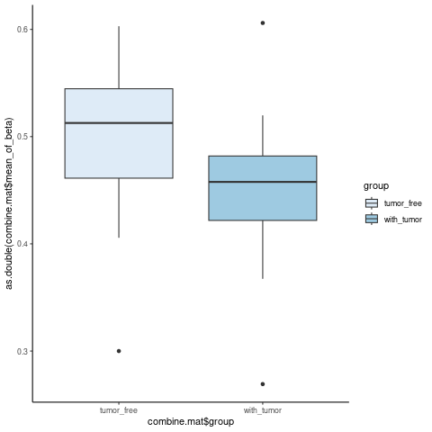
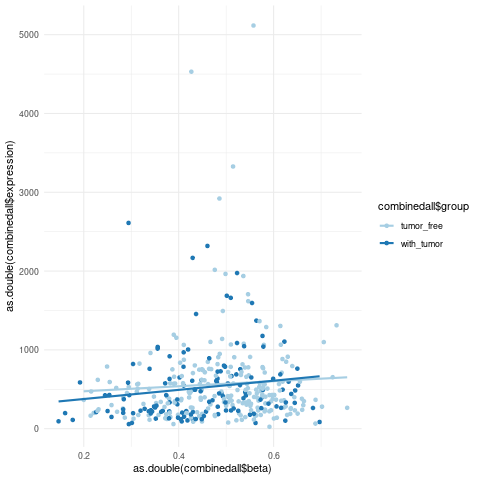

1.  **Abstract**

2.  **Introduction**

3.  **Materials and Methods**

I.  Research Participants

II. DNA methylation data pre-processing

```{r message=FALSE}
# We download data from cbiobank data_mrna_seq_v2gz, data_clinical_patient.txt.gz and methylation data from GDC portal.
library(tidyr)
library(dplyr)
library(data.table)
library(limma)
library(bumphunter)
library(biomaRt)
library(TxDb.Hsapiens.UCSC.hg19.knownGene)
library(GenomicFeatures)
library(tidyverse)

#Loading all datas
# dir <- c("/pine/scr/s/e/seyoun/project_784/Comp_Bio_784_FinalProject/01.data")
rsem <- fread("01.data/data_mrna_seq_v2_rsem.txt.gz") |> as.data.frame()
patient <- fread("01.data/data_clinical_patient.txt.gz") |> as.data.frame()
methyl <- fread("01.data/TCGA-BLCA_DNAmethylation450k_Methyl.txt_v2.gz") |> as.data.frame()
```

```{r}
# This steps were only selecting the samples in "Tumor-free and "Tumor"  
methly_beta <- methyl[,-c(1:4)]
methyl_nodup <- as.data.frame(sapply(unique(names(methly_beta)),function(col) rowMeans(methly_beta[names(methly_beta) == col])))

colnames(rsem) <- c(colnames(rsem)[1:2],gsub('.{3}$',"",colnames(rsem)[-c(1:2)]))
tumor_status <- c("TUMOR FREE","WITH TUMOR")
patient_subset <- patient[,c(2,21)][is.element(patient[,21],tumor_status),]

sub_methyl <- cbind(methyl[,1:4],methyl_nodup[,(is.element(colnames(methyl_nodup), patient_subset[,1]))])
sub_rsem <- cbind(rsem[,1:2],rsem[,(is.element(colnames(rsem), patient_subset[,1]))])

subset_nm <- colnames(sub_methyl[,!is.element(colnames(sub_methyl),colnames(sub_rsem))])[-c(1:4)]
#three samples are not overlapping with methylation and gene expression. Therefore, to match up, we subtract "TCGA-XF-A9SG" "TCGA-ZF-A9RG" "TCGA-XF-AAMF".

sub_methyl_2 <-sub_methyl[,!is.element(colnames(sub_methyl),subset_nm)]

# This step is removing probes with row containing missing values: 102,702 probes are
sub_methyl_3 <- sub_methyl_2 %>% drop_na()
```

```{r message=FALSE}
#Finding the promoter region -1500, +500 from TSS
library(biomaRt)
library(TxDb.Hsapiens.UCSC.hg19.knownGene)
library(GenomicFeatures)
library(tidyverse)
library(ChAMP)

ensembl=useMart("ensembl")
ensembl = useDataset("hsapiens_gene_ensembl",mart=ensembl)
#save(ensembl,file="ensembl"

#If you havent make the ensemble, please run useMART and create ensemble
# load("ensembl")
sub_methyl_3[,"Chromosome"] <- sub("^","chr",sub_methyl_3[,"Chromosome"])
methyl.ran <- GRanges(Rle(sub_methyl_3[,"Chromosome"]),IRanges(sub_methyl_3[,"Genomic_Coordinate"],sub_methyl_3[,"Genomic_Coordinate"]))

#We are using hg19
txdb <- TxDb.Hsapiens.UCSC.hg19.knownGene

#promoter region set up to 1500, 500
promoter.re <- promoters(txdb,upstream=1500,downstream=500)


fi.cns <- c("TXID","TXCHROM","TXNAME","GENEID","TXSTART","TXEND","TXSTRAND")
txTable <- gsub(" ","",as.matrix(biomaRt::select(txdb,keys=names(promoter.re),columns=fi.cns,keytype="TXNAME")))
txTable <- txTable[!is.na(txTable[,2]),]

map.id <- getBM(attributes=c("hgnc_symbol","entrezgene_id"),filters="entrezgene_id", values=txTable[,"GENEID"],mart=ensembl)
mer.txTable <- unique(as.matrix(merge(txTable,map.id,by.x="GENEID",by.y="entrezgene_id")))
rownames(mer.txTable) <- mer.txTable[,"TXNAME"]


inter.pro.methyl <- as.matrix(findOverlaps(methyl.ran,promoter.re))
inter.pro.methyl <- inter.pro.methyl[is.element(names(promoter.re)[inter.pro.methyl[,2]],rownames(mer.txTable)),]
pro.met.re <- cbind(mer.txTable[names(promoter.re)[inter.pro.methyl[,2]],"hgnc_symbol"],sub_methyl_3[inter.pro.methyl[,1],c(1,3,4)])
colnames(pro.met.re) <- c("gene","methyl","chr","pos")
pro.met.re <- unique(pro.met.re[which(pro.met.re[,"gene"] != ""),])
#Final pro.met.re contains gene name, methylation id, chromosome, and position. 

```

III. Differential methylation analysis

```{r message=FALSE}
#Bumphunter()
library(minfi)
library(MultiDataSet)

promoter_met_mat <- sub_methyl_3[(is.element(sub_methyl_3[,"Hybridization-REF"],pro.met.re[,"methyl"])),]
rownames(promoter_met_mat) <- promoter_met_mat[,1]
mat <- promoter_met_mat[,-c(1:4)] %>% as.matrix()
grset <- makeGenomicRatioSetFromMatrix(mat)
patient_coldata <- patient[is.element(patient[,21],tumor_status),]
patient_coldata <- patient_coldata[(!is.element(patient_coldata[,2],subset_nm)),]
colnames(patient_coldata) <- gsub("\\s", "", colnames(patient_coldata))
patient_coldata[,21] <- gsub("\\s", "", patient_coldata[,21])
patient_coldata$NoninvasiveBladderCancerTreatmentType %<>% gsub("\\(|)", "", .) %>% gsub("\\[|]","",.) %>% gsub("\\s", "",.)
colData(grset) <- cbind(colData(grset),patient_coldata[ order(match(patient_coldata[,2],rownames(colData(grset)))), ])

status <- pData(grset)$PersonNeoplasmStatus
treatment <- pData(grset)$NoninvasiveBladderCancerTreatmentType
sex <-  pData(grset)$Sex
age <- pData(grset)$DiagnosisAge

deseignmatrix <- model.matrix(~status+sex+age)
#we use sex and age for covariates and 10% difference between the two groups

dmrs <- bumphunter(grset, design =deseignmatrix, type="Beta",cutoff=0.1)
save(dmrs,file="dmrs")
head(dmrs$table)
```

```{r}
library(limma)
library(dplyr)
library(readr)
library(ggplot2)

theme_set(theme_bw())

# subset methylation data according to pro.met.re
# and remove old, unnecessary columns
working.data = left_join(pro.met.re, sub_methyl_3, by=c('methyl'='Hybridization-REF'))
working.data = working.data %>% dplyr::select(-Gene_Symbol, -Chromosome, -Genomic_Coordinate)

# only need working.data
rm(list=setdiff(ls(), "working.data"))

# stash row information
meta.data = working.data[,1:4]

# average methylation by gene
working.data = working.data %>%
  dplyr::select(-methyl, -chr, -pos) %>%
  group_by(gene) %>%
  summarize_all(mean)

# load patient data
clinical.patient = read_delim('01.data/data_clinical_patient.txt', skip=4)
clinical.sample = read_delim('01.data/data_clinical_sample.txt', skip=4)

# combine the data and subset to those in working.data
patient = inner_join(clinical.patient, clinical.sample, by='PATIENT_ID')
patient = patient %>%
  filter(PATIENT_ID %in% colnames(working.data)) %>%
  group_by(PATIENT_ID) %>%  # one patient has two samples, remove second one
  dplyr::slice(n=1) %>%
  ungroup()
rm(list=c('clinical.patient', 'clinical.sample'))

# set column names lower case
colnames(patient) = tolower(colnames(patient))

# put patient data in same order as methylation data
patient = patient[match(colnames(working.data[,-1]), patient$patient_id), ]


# Limma -------------------------------------------------------------------


# patient covariate matrix
design.matrix = model.matrix(~ tumor_status + sex + age,
                             data = patient)
colnames(design.matrix) = c('(Intercept)', 'tumor', 'male', 'age')

# fit models
limma.fit = lmFit(working.data[,-1], design=design.matrix)
limma.fit.eb = eBayes(limma.fit)

# look at results
top.table = topTable(limma.fit.eb, coef='tumor', sort.by='p', p.value=0.2, number=10000)

# extract gene names and meta information
genes.select = working.data$gene[as.numeric(row.names(top.table))]
genes.select.up = working.data$gene[as.numeric(row.names(top.table %>% filter(logFC>0)))]
genes.select.down = working.data$gene[as.numeric(row.names(top.table %>% filter(logFC<0)))]
genes.final = meta.data %>% filter(gene %in% genes.select)

top.table$gene = genes.select

# # save it
# write_csv(genes.final, 'diff_meth_genes.csv')


# # looking at residual plots
# row_num = 5
# fitted.values = limma.fit.eb$design %*% limma.fit.eb$coefficients[row_num,]
# plot(fitted.values, working.data[row_num, 2:ncol(working.data)])

```


```{r}
# Plots -------------------------------------------------------------------

# # volcano plot
# volcanoplot(limma.fit.eb, coef='tumor', names=working.data$gene,
#             highlight = 135)

# do manual volcano plot

# get all results
all.res = topTable(limma.fit.eb, coef='tumor', sort.by='p', number=100000)
all.res$highlight = all.res$adj.P.Val < 0.2

# plot
gg_volcano = ggplot(all.res %>% mutate(P.Value = -log10(P.Value)), 
                    aes(x=logFC, y=P.Value, color=highlight)) +
  geom_point(size = 0.7) +
  scale_color_manual(values = c('black', 'blue')) +
  scale_x_continuous(limits = c(-0.1, 0.1)) +
  scale_y_continuous(limits = c(0, 6.2)) +
  labs(x = 'beta coefficient',
       y = '-log10(p-value)') +
  theme(legend.position = 'none')

gg_volcano
```

```{r}
# pca
working.data.select = working.data %>% filter(gene %in% genes.select)
pc.0 = prcomp(t(working.data.select[,2:ncol(working.data.select)]))
dat = data.frame(pc.0$x[,1:2], tumor = patient$tumor_status)
ggplot(dat, aes(x=PC1, y=PC2, col=tumor)) +
  geom_point() +
  labs(title='pca on 128 identified genes')
```

```{r}
# mRNA --------------------------------------------------------------------

# read in data
mrna = read_delim('01.data/data_mrna_seq_v2_rsem.txt')

# subset to match working.data
mrna = mrna %>%
  dplyr::rename(gene = Hugo_Symbol) %>%
  dplyr::rename_all(function(x) gsub('-01$', '', x)) %>%
  dplyr::select_at(colnames(working.data))

# do log(1+x) transform
mrna[,2:ncol(mrna)] = log(1+mrna[,2:ncol(mrna)])

# # do pca
# pc.1 = prcomp(t(mrna[,2:ncol(mrna)]))
# dat = data.frame(pc.1$x[,1:2], tumor = patient$tumor_status)
# ggplot(dat, aes(x=PC1, y=PC2, col=tumor)) +
#   geom_point() +
#   labs(title='pca on transformed gene expression, all genes')
```

```{r}
# subset to match 128 identified genes
# only 120 in the dataset
mrna = mrna %>%
  filter(gene %in% genes.select)

# # pca
# pc.2 = prcomp(t(mrna[,2:ncol(mrna)]))
# dat = data.frame(pc.2$x[,1:2], tumor = patient$tumor_status)
# ggplot(dat, aes(x=PC1, y=PC2, col=tumor)) +
#   geom_point() +
#   labs(title='pca on transformed gene expression, 135 identified genes')
```


```{r}
# correlation b/t gene expression and diff methylation
mrna.avg = cbind(mrna$gene, rowMeans(mrna[,2:ncol(mrna)])) %>% as.data.frame()
top.table.2 = top.table %>%
  filter(gene %in% mrna$gene)
top.table.2 = top.table.2[match(mrna.avg$V1, top.table.2$gene), ]
cor(top.table.2$logFC, as.numeric(mrna.avg$V2))

dat = data.frame(diff_meth = top.table.2$logFC, 
                 gene_exp = as.numeric(mrna.avg$V2))
ggplot(data=dat, aes(x=diff_meth, y=gene_exp)) +
  geom_point() +
  labs(x = 'Differential methylation (beta)',
       y = 'Average gene expression, log(1+x)')

```


IV. Functional enrichment and network analysis

```{r message=FALSE}
#Finding genes in the DMR region
load("dmrs")
txdb <- TxDb.Hsapiens.UCSC.hg19.knownGene
load("ensembl")
bumphunter_gr <- GRanges(Rle(dmrs$table[,"chr"]),IRanges(dmrs$table[,"start"],dmrs$table[,"end"]+20000))
gene_list <- subsetByOverlaps(genes(txdb),bumphunter_gr)
map_ids <- getBM(attributes=c("hgnc_symbol","entrezgene_id"),filters="entrezgene_id", values=gene_list$gene_id,mart=ensembl)

map_ids #There are 15 genes identified in DMR region

#those are the genes that limma and bumphunter overlaps
intersect(top.table$gene,map_ids$hgnc_symbol)
```
```{r message=FALSE}
go <- fread("go.txt",sep ="\t", header = TRUE, stringsAsFactors = FALSE)
newgo <- cbind(go,do.call(rbind,lapply(strsplit(go$members_input_overlap_geneids,";") ,function(y)length(y))))
newgo$Generatio <- newgo$V1/newgo$size
newgo <- newgo  %>% as.data.frame

path <- fread("path.txt", sep ="\t", header = TRUE, stringsAsFactors = FALSE)
newpath <- cbind(path,do.call(rbind,lapply(strsplit(path$members_input_overlap_geneids,";") ,function(y)length(y))))
newpath$Generatio <- newpath$V1/newpath$size
 newpath$pathwaynm <- c(rep("patwhay"))
newpath <- newpath  %>% as.data.frame

par(mfrow=c(1,2))


# import package
library("ggplot2")

# create fake data
set.seed(1024) # keep reproducibility
go <- paste0("GO", sample(1000:2000, 5))
data <- data.frame("GOs" = rep(go, 2), 
                   "Condition" = rep(c("A", "B"), each = 5),
                   "GeneRatio" = 1 / sample(10, 10), 
                   "p.adjust" = 0.05 / sample(10, 10))

library(ggpubr)
# plot: Go


ggplot(newgo, aes(x = newgo[,"term_category"], y = newgo[,"term_name"], 
	color = as.double(newgo[,2]), size = as.double(newgo[,"Generatio"]))) +
	geom_point() +
	scale_color_gradient(low = "red", high = "blue") +
	theme_bw() +
	ylab("") +
  	xlab("") +
   	ggtitle("GO enrichment analysis")+
	labs(size="Generatio", colour="q-value")


# plot: pathway

ggplot(newpath, aes(x = pathwaynm , y = pathway, 
	color = as.double(newpath[,2]), size = as.double(newpath[,"Generatio"]))) +
	geom_point() +
	scale_color_gradient(low = "red", high = "blue") +
	theme_bw() +
	ylab("") +
  	xlab("") +
   	ggtitle("Pathway enrichment analysis")+
	labs(size="Generatio", colour="q-value")


```


4.  **Results**

    I.  **Overview of the study cohort**

    II. **Differential DNA methylation analysis in the two subgroups**

        i.  **Linear**

        ii. **Bumphunter**

    III. **Functional enrichment analysis and network**
    III. **Case study**
    
```{r message=FALSE}

#geneset <- c("PRKCZ","CDH5","CTNNB1","APC2","TLE2)
load("grset")
load("promoter_met_mat")
rsem <- fread("01.data/data_mrna_seq_v2_rsem.txt.gz") |> as.data.frame()
# We can add any genes are interesting. 
geneset <- c("CDH5")
tumor_free <- assay(grset)[,which(grset$PersonNeoplasmStatus == "TUMORFREE" )]
withtumor <- assay(grset)[,which(grset$PersonNeoplasmStatus == "WITHTUMOR" )]
ppi_gene_mat <- promoter_met_mat[is.element(promoter_met_mat[,2],geneset),]

for (i in 1:length(geneset)){
  onegene <- ppi_gene_mat[which(ppi_gene_mat[,2] == geneset[i]),]
  cpgid <- rownames(onegene)
  tfree_subset <- tumor_free[is.element(rownames(tumor_free),cpgid),]
  wtiht_subset <- withtumor[is.element(rownames(withtumor),cpgid),]
  rowmean_control <- cbind(t(rbind(rowMeans(tfree_subset))),rep("tumor_free"))
  rowmean_case <- cbind(t(rbind(rowMeans(wtiht_subset))),rep("with_tumor"))
  combine.mat <- rbind(rowmean_control,rowmean_case) %>% as.data.frame()
  colnames(combine.mat) <- c("mean_of_beta","group")
  p <- ggplot(combine.mat, aes(x=combine.mat$group, y=as.double(combine.mat$mean_of_beta),fill=group)) + geom_boxplot()+scale_fill_brewer(palette="Blues")+theme_classic()
  png(paste("/pine/scr/s/e/seyoun/project_784/Comp_Bio_784_FinalProject/03.plots","/",geneset[i],".png",sep=""))
  print(p)
  dev.off()
}

for (i in 1:length(geneset)){
  rsem_subset <- rsem[is.element(rsem[,1],geneset[i]),]
  rsem_test <- t(rsem_subset[-c(1:2)])
  onegene <- ppi_gene_mat[which(ppi_gene_mat[,2] == geneset[i]),]
  cpgid <- rownames(onegene)
  tfree_subset <- tumor_free[is.element(rownames(tumor_free),cpgid),]
  wtiht_subset <- withtumor[is.element(rownames(withtumor),cpgid),]
  colmean_control <- cbind(t(rbind(colMeans(tfree_subset))),rep("tumor_free"))
  colmean_case <- cbind(t(rbind(colMeans(wtiht_subset))),rep("with_tumor"))
  combine.mat <- rbind(colmean_control,colmean_case) %>% as.data.frame()
  combinedall <- merge(combine.mat,rsem_test,by='row.names',all.x=FALSE) %>% as.data.frame()
  colnames(combinedall) <- c("sample","beta","group","expression")
  p <- ggplot(combinedall, aes(x=as.double(combinedall$beta), y=as.double(combinedall$expression),color=combinedall$group)) + geom_point()+geom_smooth(method=lm, se=FALSE)+scale_color_brewer(palette="Paired")+theme_minimal()
  png(paste("/pine/scr/s/e/seyoun/project_784/Comp_Bio_784_FinalProject/03.plots","/",geneset[i],"corr",".png",sep=""))
  print(p)
  dev.off()
}
```





    
5.  **Discussion**

    I.  **Recap**

    II. **Observation**

    III. **Limitation**

    IV. **Future work**

6.  **Conclusion**

7.  **References**

